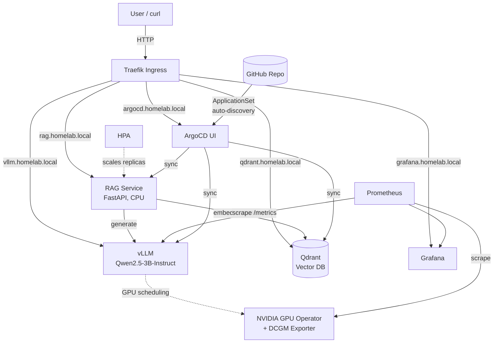

# AI Infrastructure Homelab — Self-Hosted RAG Platform on Kubernetes

A GPU-scheduled Kubernetes cluster that serves a local LLM, runs a full retrieval-augmented generation (RAG) pipeline, and deploys itself via GitOps — built from scratch as a hands-on transition project from traditional DevOps/sysadmin work into AI infrastructure engineering.

Everything below is real, running infrastructure on repurposed hardware — not a cloud tutorial.

## What This Project Demonstrates

This isn't a "follow the docs" deployment. Every piece — GPU scheduling, model serving, vector search, GitOps, observability, and autoscaling — was built, broken, debugged, and fixed by hand. The [Debugging & Engineering Decisions](#debugging--engineering-decisions) section below is arguably the most important part of this README: it's the difference between "I ran a script" and "I understand why the script works."

## Architecture



### Current Hardware

| Machine | Specs | Role |
|---|---|---|
| Dell Precision 3640 Tower | i7, 32GB RAM, **RTX 2070 Super (8GB)** | **Primary node** — bare-metal Ubuntu 26.04 + k3s, runs the entire stack below |

### Planned Fleet Expansion (not yet built)

| Machine | Specs | Planned Role |
|---|---|---|
| Dell XPS (laptop) | i9, 64GB RAM, RTX 3050 Ti (4GB) | Secondary GPU node via Proxmox + LXC GPU passthrough (VM passthrough ruled out — see below) |
| Headless laptop | No GPU | Dedicated k3s control-plane node |
| Acer Nitro | Ryzen 7, 32GB RAM, RTX 5060 (8GB) | On-demand large-model demo node |
| Sager P170SM | i7, 16GB RAM, GTX 770M (Kepler) | CPU-only worker (GPU is architecturally too old for current CUDA/PyTorch) |

## Tech Stack

| Layer | Technology |
|---|---|
| OS / Orchestration | Ubuntu 26.04, k3s (bare metal, not virtualized) |
| GPU Scheduling | NVIDIA GPU Operator, NVIDIA Container Toolkit, DCGM Exporter |
| Model Serving | vLLM (OpenAI-compatible API), Qwen2.5-3B-Instruct |
| Vector Database | Qdrant (StatefulSet, persistent storage) |
| RAG Application | Custom FastAPI service (Python) — no LangChain |
| Ingress | Traefik |
| GitOps | ArgoCD + ApplicationSet (Git-directory auto-discovery) |
| Observability | Prometheus, Grafana, kube-prometheus-stack |
| Autoscaling | Kubernetes HPA (CPU-based) |

## What It Does

1. **Ingest** — a document is chunked, embedded (`all-MiniLM-L6-v2`, CPU), and stored in Qdrant with its source metadata.
2. **Query** — a question is embedded, Qdrant returns the top-k most relevant chunks.
3. **Augment** — the retrieved chunks are inserted into a prompt as grounding context.
4. **Generate** — the prompt is sent to vLLM, which returns an answer grounded in the retrieved text rather than the model's training data alone.

```bash
curl http://rag.homelab.local/query \
  -H "Content-Type: application/json" \
  -d '{"question": "What language is Qdrant written in?"}'
# {"answer":"Qdrant is written in Rust.","sources":["test-doc"]}
```

## GitOps & Deployment Architecture

The repo is split by a deliberate rule: **platform bootstrap is manual, workload apps are GitOps-managed.**

```
AI_Infrastructure/
├── apps/                      # Auto-discovered by ArgoCD ApplicationSet — git push deploys
│   ├── vllm/
│   ├── qdrant/
│   └── rag-service/
├── k3s/                       # Applied manually — platform bootstrap (chicken-and-egg problem)
│   ├── homelab-appset.yaml    # The ApplicationSet itself
│   ├── argocd-ingressroute.yaml
│   ├── grafana-ingressroute.yaml
│   ├── dcgm-servicemonitor.yaml
│   └── monitoring-values.yaml
└── README.md
```

**Why the split:** ArgoCD managing its own ingress route, or the Prometheus stack that monitors the whole cluster, creates a dependency loop — if a sync ever breaks, you need to already be able to reach the tool that would fix it. Anything in `k3s/` is cluster-platform infrastructure applied directly; anything in `apps/` is a workload, and dropping a new folder there is the *only* step needed to deploy it — an `ApplicationSet` with a Git-directory generator auto-creates the ArgoCD `Application` for it.

## Observability

Two custom Grafana dashboards, built from confirmed live metrics (not assumed from documentation, since metric names have changed across vLLM versions):

- **GPU Dashboard** (community dashboard `12239`): temperature, power draw, SM clock, utilization — from DCGM Exporter.
- **vLLM Inference Dashboard** (custom-built): requests running/waiting, token throughput, Time-to-First-Token (p50/p95/p99), end-to-end request latency (p50/p95/p99), KV cache usage.

## Autoscaling — and Why vLLM Doesn't Get an HPA

The RAG service (stateless, CPU-bound) has a working `HorizontalPodAutoscaler` (1→4 replicas on CPU utilization). **vLLM does not** — and that's a deliberate decision, not an oversight. vLLM requests a dedicated GPU (`nvidia.com/gpu: 1`), and this node has exactly one GPU with no sharing strategy configured. A second replica would sit in `Pending` forever waiting for hardware that doesn't exist. Horizontal scaling only makes sense for the components that don't have a hardware ceiling; GPU-bound serving scales via more hardware or a model gateway (see Roadmap), not more replicas.

## Debugging & Engineering Decisions

The real value of this project is in what went wrong and why. A sample of the non-trivial issues diagnosed and resolved from scratch:

**1. Containerd silently lost its CNI configuration**
After the NVIDIA GPU Operator installed its containerd drop-in config (`/etc/containerd/conf.d/99-nvidia.toml`), every pod failed with `cni plugin not initialized` — but flannel's own logs showed it starting successfully. Root cause: this k3s/containerd version uses a drop-in `imports` pattern, and the NVIDIA toolkit's drop-in only added the GPU runtime block — nothing else supplied containerd's CNI `bin_dir`/`conf_dir`, so it silently fell back to non-existent default paths. Fixed by adding an explicit CNI config drop-in alongside NVIDIA's.

**2. cgroup driver mismatch broke every GPU-scheduled pod**
`OCI runtime create failed: expected cgroupsPath to be of format "slice:prefix:name"` — the cluster used the cgroupfs driver, but the NVIDIA container runtime defaulted to expecting systemd-style cgroups, regardless of what the rest of the cluster used. Fixed in the NVIDIA runtime's own config (`systemd-cgroup = false`), found by tracing the actual config file path rather than assuming the standard system location.

**3. vLLM's memory math didn't add up**
`ValueError: No available memory for the cache blocks` — at `gpu_memory_utilization=0.85` on an 8GB card, model weights (5.79GB) plus CUDA graph capture overhead left a **negative** KV cache budget before serving even started. Fixed by disabling CUDA graph capture (`--enforce-eager`) and raising the utilization ceiling, after first confirming the host GPU itself was clean (no desktop environment holding VRAM).

**4. A Kubernetes label subtlety silently broke metrics collection**
vLLM's Prometheus target showed "no matching targets" despite the service running fine. `ServiceMonitor.spec.selector` matches a Service's `metadata.labels` — not its `spec.selector` (which is a different field used to find pods). The Service had a pod selector but no labels of its own. Fixed by adding explicit labels to the Service.

**5. ArgoCD and the HPA fought over the same field**
After the RAG service's HPA scaled it to 4 replicas under load, it kept flapping back to 1 — because ArgoCD's `selfHeal` was "correcting" the live replica count back to what Git declared (`replicas: 1`), fighting the HPA's decision every reconcile loop. Fixed by adding `ignoreDifferences` for `spec/replicas` on Deployments in the `ApplicationSet`, so the HPA is the sole owner of that field.

## Key Engineering Decisions

- **Bare metal, not virtualized, for the GPU node.** Kubernetes already provides workload isolation via the GPU device plugin; an extra virtualization layer would add passthrough complexity (and, on laptop GPUs specifically, real reliability problems — see Roadmap) without a corresponding benefit for a node whose only job is serving models.
- **Qwen2.5-3B-Instruct, not a 7B model.** An 8GB card can't fit a 7B model at fp16 without quantization; 3B fits comfortably and let the pipeline get proven before adding quantization complexity.
- **Custom FastAPI RAG service instead of LangChain.** More code to write, but every step — chunking, embedding, retrieval, prompt construction — is something that can be explained line-by-line in an interview instead of "the framework handled it."
- **Qdrant as a StatefulSet, everything else as a Deployment.** Qdrant is the one component in this stack that needs persistent, stable identity; using the correct Kubernetes primitive for the one workload that actually needs it (rather than defaulting to Deployment everywhere) matters.
- **The embedding model runs on CPU, deliberately.** It shares the box with an already VRAM-constrained vLLM instance; embedding models are cheap enough on CPU that this isn't a real tradeoff.

## Secret Management

Kubernetes Secrets are opaque, not encrypted — anything referencing one in a Helm values file (like a Grafana admin password) risks landing in Git as plaintext the moment that file gets committed, which is exactly what happened early in this project. Fixed by introducing **Sealed Secrets** (Bitnami): the real credential is encrypted client-side with `kubeseal` against the in-cluster controller's public key, producing a `SealedSecret` that's genuinely safe to commit — only the controller's private key, which never leaves the cluster, can decrypt it back into a real Secret. Grafana now reads its admin credentials via `existingSecret`, and the values file itself no longer contains anything sensitive.

## Roadmap

- **LiteLLM gateway** — route requests between the local vLLM instance and a hosted API when local GPU capacity is saturated. This is the real answer to "how do you scale a single-GPU inference service," instead of a horizontal autoscaler that would never trigger.
- **Fleet expansion** — bring the Dell XPS online as a secondary GPU node. Its RTX 3050 Ti is a muxless laptop GPU, which rules out full VM PCI passthrough (no accessible vBIOS, no dedicated display output — a well-documented dead end); the plan is LXC-level device passthrough instead, which doesn't require reassigning the PCI device away from the host.
- **CI/CD for the RAG service image** — replace the manual `docker build → save → import` cycle with a GitHub Actions pipeline pushing to a container registry.
- **TLS via cert-manager** — internal CA for HTTPS across all services, appropriate now that the cluster does more than solo experimentation.

## Try It Yourself

```bash
# Ingest a document
curl http://rag.homelab.local/ingest \
  -H "Content-Type: application/json" \
  -d '{"text": "Your text here", "source": "my-doc"}'

# Ask a question grounded in ingested documents
curl http://rag.homelab.local/query \
  -H "Content-Type: application/json" \
  -d '{"question": "Your question here"}'
```

